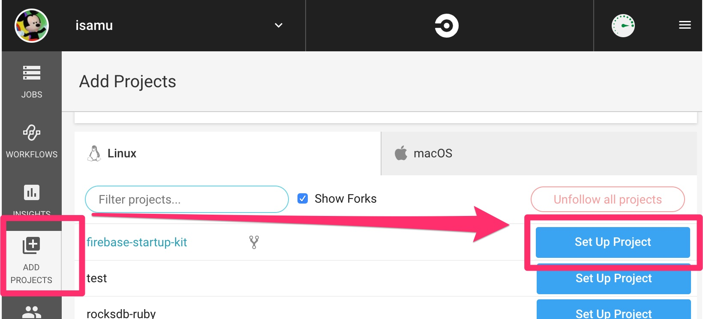
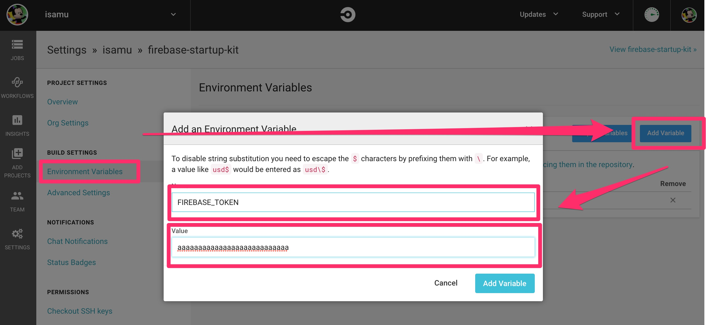

## Setup CircleCI

Go to [CircleCI](https://circleci.com)

Add your project to CircleCI




## Get FIREBASE_TOKEN

```
$  firebase login:ci

Visit this URL on any device to log in:
https://accounts.google.com/o/oauth2/auth?......

Waiting for authentication...

✔  Success! Use this token to login on a CI server:

(Your token)

Example: firebase deploy --token "$FIREBASE_TOKEN"
```

## Add your token to CircleCI Environment Variables .




## Push your code, then deployment will run.

```
$git push origin master
```
